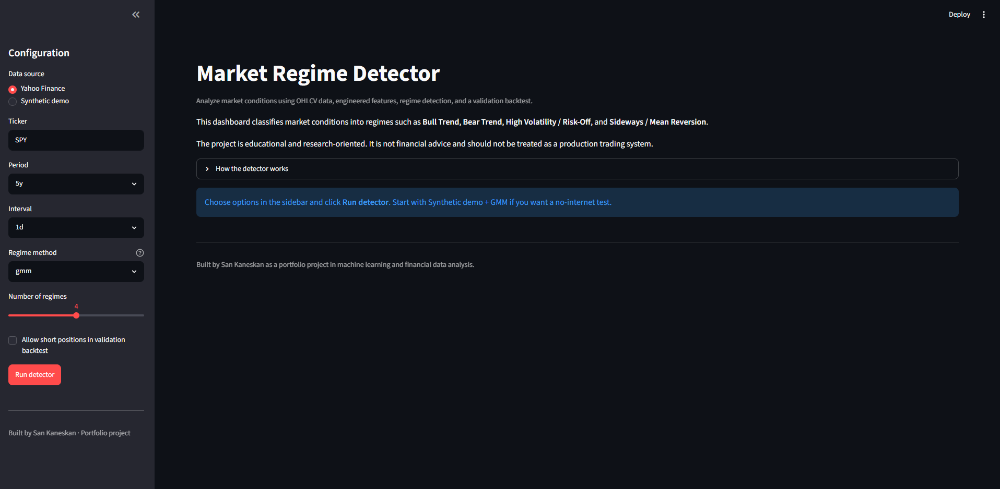
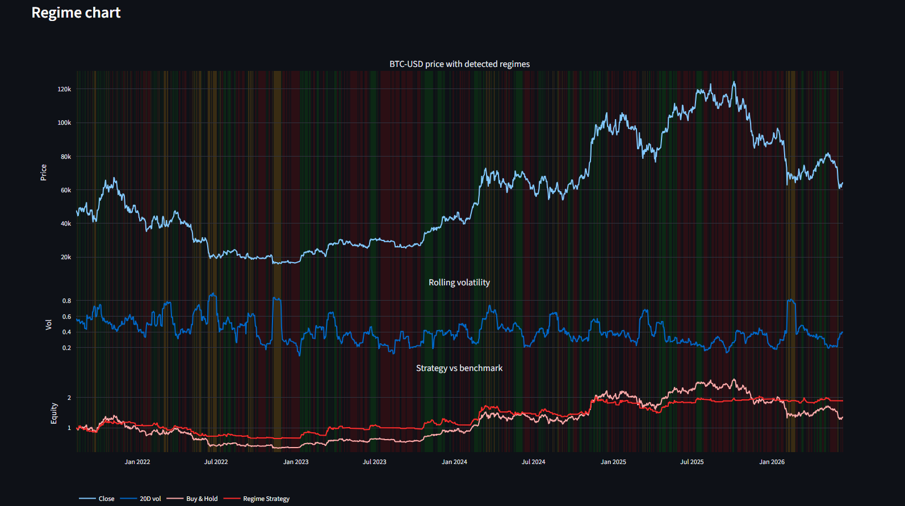
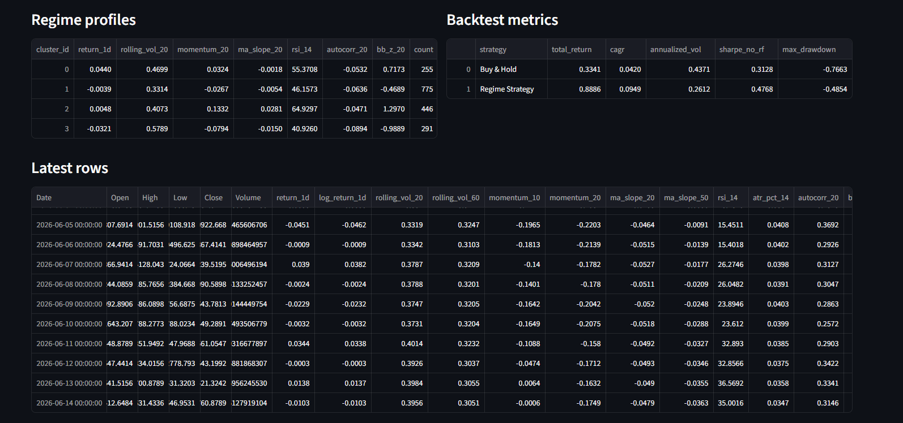

# Market Regime Detector

A Python and Streamlit project for detecting financial market regimes using time-series data, feature engineering, unsupervised machine learning, and simple backtest validation.

The goal of this project is to classify the current market environment into regimes such as **bull trend**, **bear trend**, **high volatility**, or **sideways / mean-reverting conditions**. Instead of trying to predict the exact next price, the project focuses on identifying the type of market behavior that is currently present.

Built by San Kaneskan as a portfolio project exploring machine learning, applied mathematics, and financial time-series analysis.

---

## Live Demo

Deployed app:

```text
link
```


---

## Screenshots

Add screenshots of the app here.

### Dashboard



### Regime Chart



### Backtest Metrics



---

## Project Overview

Financial markets behave differently over time. Some periods are trending upward, some are trending downward, some are unstable, and others move sideways without a clear direction.

This project takes market data, creates useful financial features, applies a regime detection model, and visualizes the results in an interactive dashboard.

The main pipeline is:

```text
Market data
    ↓
Feature engineering
    ↓
Regime detection model
    ↓
Regime labels
    ↓
Visualization
    ↓
Backtest validation
```

---

## Main Features

- Load real market data from Yahoo Finance using `yfinance`
- Generate synthetic demo data for testing and offline use
- Create financial features from OHLCV data
- Detect regimes using rule-based logic, KMeans, GMM, or HMM
- Visualize regimes with interactive Plotly charts
- Explore results in a Streamlit dashboard
- Run the project from both a dashboard and command line
- Export generated results such as regime labels, profiles, metrics, and an HTML chart
- Run smoke tests with `pytest`

---

## Tech Stack

| Area | Tools |
|---|---|
| Language | Python |
| Data processing | NumPy, Pandas |
| Machine learning | scikit-learn, hmmlearn |
| Market data | yfinance |
| Visualization | Plotly |
| Dashboard | Streamlit |
| Testing | pytest |

---

## Project Structure

```text
market-regime-detector-portfolio/
│
├── app/
│   └── streamlit_app.py
│
├── market_regime_detector/
│   ├── __init__.py
│   ├── backtest.py
│   ├── cli.py
│   ├── data.py
│   ├── features.py
│   ├── regimes.py
│   └── visualization.py
│
├── tests/
│   └── test_smoke.py
│
├── README.md
├── LEARNING_PATH.md
├── requirements.txt
├── pyproject.toml
└── .gitignore
```

---

## How It Works

### 1. Data Loading

The project supports two data sources:

- **Yahoo Finance data** for real historical market data
- **Synthetic demo data** for testing and demonstration

The data-loading logic is in:

```text
market_regime_detector/data.py
```

---

### 2. Feature Engineering

The raw market data contains OHLCV columns:

```text
Open, High, Low, Close, Volume
```

The project converts these into financial features that better describe market behavior.

Examples include:

| Feature | Meaning |
|---|---|
| `return_1d` | One-period percentage price change |
| `log_return_1d` | Logarithmic price return |
| rolling volatility | Recent size of price movements |
| momentum | Recent trend direction |
| RSI | Overbought / oversold indicator |
| ATR | Average daily price range |
| Bollinger z-score | Distance from recent average price |
| volume z-score | Whether volume is unusually high or low |

The feature logic is in:

```text
market_regime_detector/features.py
```

---

### 3. Regime Detection

The project supports four methods:

| Method | Description | Best for |
|---|---|---|
| Rule-based | Uses clear if/else thresholds | Learning and explainability |
| KMeans | Groups similar market periods into hard clusters | Simple ML baseline |
| GMM | Uses probabilistic clustering | Recommended default |
| HMM | Models hidden states and transitions over time | Advanced sequence modelling |

The model logic is in:

```text
market_regime_detector/regimes.py
```

---

### 4. Visualization

The dashboard uses Plotly and Streamlit to show:

- market price over time
- detected regimes
- latest feature rows
- regime profiles
- backtest metrics
- explanations for columns and model choices

The visualization logic is in:

```text
market_regime_detector/visualization.py
app/streamlit_app.py
```

---

### 5. Backtest Validation

The project includes a simple backtest to check whether regime labels contain useful information.

The backtest is not intended to be a production trading strategy. It is used as a basic validation step to compare the behavior of a regime-aware strategy against a simple buy-and-hold benchmark.

The backtest logic is in:

```text
market_regime_detector/backtest.py
```

---

## Why I Chose This Approach

I chose regime detection because I wanted to build a project that combines machine learning with applied mathematics and financial data, while avoiding unrealistic claims about predicting exact future prices.

A direct price prediction model can easily become misleading because financial markets are noisy and difficult to forecast. Regime detection is a more practical learning problem because it asks a different question:

```text
What type of market environment are we currently in?
```

This still involves important machine learning and mathematical ideas, but it is easier to explain, evaluate, and visualize.

---

## Technical Decisions and Tradeoffs

### Plotly instead of Matplotlib

I used Plotly because the project is designed as an interactive dashboard. Plotly allows users to zoom, hover, inspect individual points, and export interactive HTML charts.

Matplotlib would be a good choice for static report figures, but Plotly fits the app-style interface better.

### Synthetic data

I kept synthetic data because it makes the project easier to test and demonstrate. It allows the full pipeline to run even if Yahoo Finance is unavailable or there is no internet connection.


### GMM as the recommended default

I chose GMM as the recommended default because it is more flexible than KMeans but easier to explain than HMM.

KMeans assigns each row to one hard cluster, while GMM handles overlapping clusters more naturally. This is useful because market regimes are rarely perfectly separated.

### HMM as an advanced option

HMM is included because market regimes are sequential. A market often stays in the same regime for multiple periods before transitioning to another one.

The HMM method uses the `hmmlearn` library to model hidden states and transitions over time.

---

## Limitations

This project is educational and should not be treated as a production trading system.

Current limitations:

- The backtest does not include trading fees, slippage, taxes, or realistic execution constraints.
- The current validation is simple and does not include full walk-forward testing.
- More complex models, especially HMM, can overfit historical data.
- Regime labels are statistical interpretations and may not always match real economic regimes.
- Yahoo Finance data can sometimes contain missing values or adjusted price differences.
- The model currently uses only market price and volume data, not macroeconomic indicators, news, rates, or cross-asset data.
- Different assets may need different feature windows or model settings.

---

## What I Learned

While building this project, I learned how to:

- Structure a Python data science project into reusable modules
- Work with OHLCV financial market data
- Create features such as returns, volatility, momentum, RSI, ATR, and Bollinger z-score
- Apply unsupervised learning to time-series data
- Compare rule-based logic, KMeans, GMM, and HMM
- Build an interactive dashboard with Streamlit and Plotly
- Add a command-line interface for reproducible experiments
- Use basic tests to check that the main pipeline works
- Think about validation issues such as look-ahead bias and overfitting
- Explain technical tradeoffs instead of only focusing on code

The biggest thing I learned is that a financial machine learning project does not need to predict exact prices to be useful. Classifying the market environment can already provide useful information for analysis and risk management.

---

## Debugging and Iteration Notes

During development, I made several changes to improve the project:

- Removed CSV upload to simplify the user experience
- Moved `hmmlearn` into the main `requirements.txt` so all models are available after one install
- Added more dashboard explanations for users who are new to financial machine learning
- Kept synthetic data to make testing and demos more reliable
- Added smoke tests to check that the core pipeline runs correctly

These changes made the project easier to run, explain, and present.

---

## What I Would Improve Next

Future plans is expandanding this into a broader Quant ML Research Dashboard with more modules

Future improvements I would like to add to market regime detector:

1. Walk-forward validation for more realistic model evaluation
2. Transaction costs and slippage in the backtest
3. Support for comparing multiple tickers
4. A dashboard page for comparing all regime detection methods
5. More tests for missing data and failed downloads
6. Downloadable reports from the Streamlit app
7. More stable regime naming across different assets
8. Optional static charts for written reports
9. Extra data sources such as macro indicators or volatility indexes

---

## Installation

Clone the repository:

```bash
git clone https://github.com/your-username/market-regime-detector.git
cd market-regime-detector
```

Create a virtual environment:

```bash
python -m venv .venv
```

Activate it on Windows PowerShell:

```powershell
.venv\Scripts\Activate.ps1
```

Activate it on macOS or Linux:

```bash
source .venv/bin/activate
```

Install dependencies:

```bash
pip install -r requirements.txt
```

---

## Running the Streamlit App

Start the dashboard with:

```bash
streamlit run app/streamlit_app.py
```

Then open the local URL shown in the terminal, usually:

```text
http://localhost:8501
```

---

## Running from the Command Line

Run with synthetic demo data:

```bash
python -m market_regime_detector.cli --synthetic --method gmm --out outputs/demo_gmm
```

Run with Yahoo Finance data:

```bash
python -m market_regime_detector.cli --ticker SPY --period 5y --method gmm --out outputs/spy_gmm
```

Try another model:

```bash
python -m market_regime_detector.cli --ticker SPY --period 5y --method hmm --out outputs/spy_hmm
```

Available methods:

```text
rule
kmeans
gmm
hmm
```

---

## Output Files

When the program runs, it creates an `outputs/` folder.

Typical output files:

| File | Description |
|---|---|
| `regimes.csv` | Market data, features, and assigned regime labels |
| `regime_profiles.csv` | Summary statistics for each regime |
| `performance_metrics.csv` | Basic backtest results |
| `regime_dashboard.html` | Exported interactive Plotly chart |

The `outputs/` folder is generated automatically and does not need to be committed to GitHub.

---

## Running Tests

Run the smoke tests with:

```bash
pytest
```

The tests check that the main pipeline works on synthetic data.

---

## Deployment Notes

This project can be deployed on Streamlit Community Cloud.

Before deploying, make sure the repository includes:

```text
requirements.txt
app/streamlit_app.py
market_regime_detector/
```

Streamlit will install the dependencies from `requirements.txt`.

Deployment link placeholder:

```text
Add deployed Streamlit link here
```

---

## Disclaimer

This project is for educational and portfolio purposes only.

It is not financial advice, investment advice, or a production trading system. Historical backtest results do not guarantee future performance.